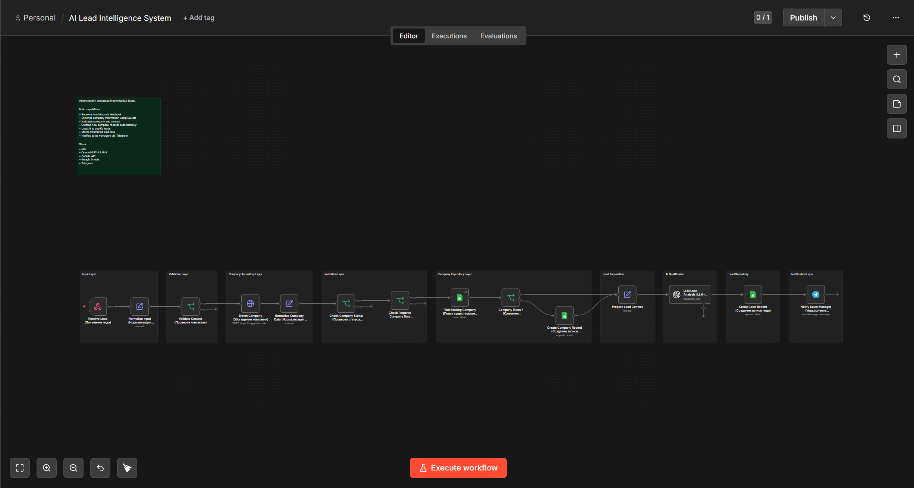
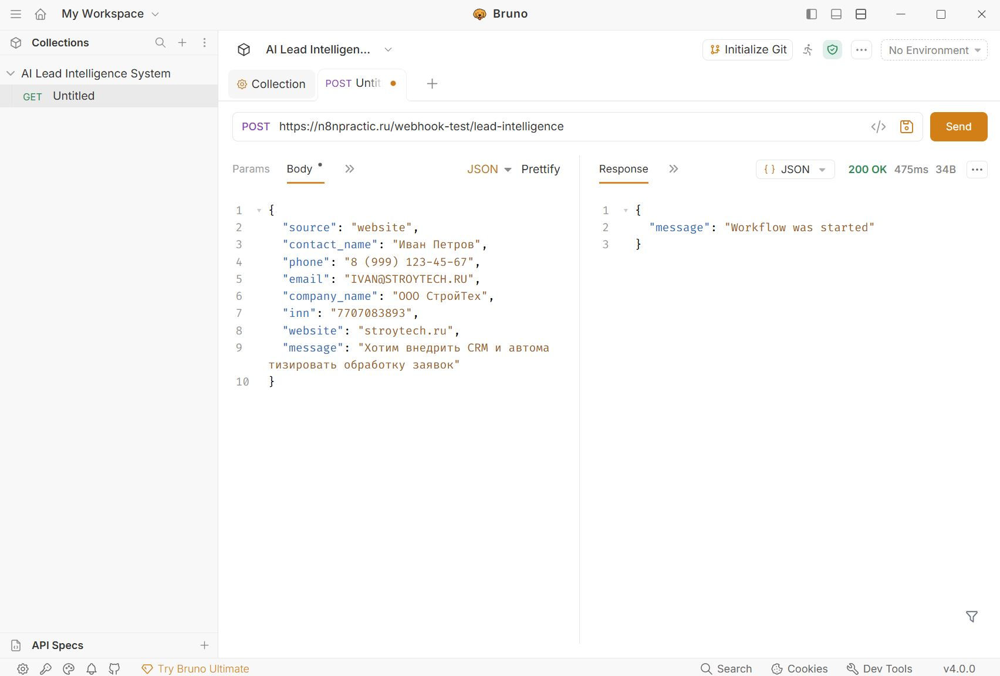
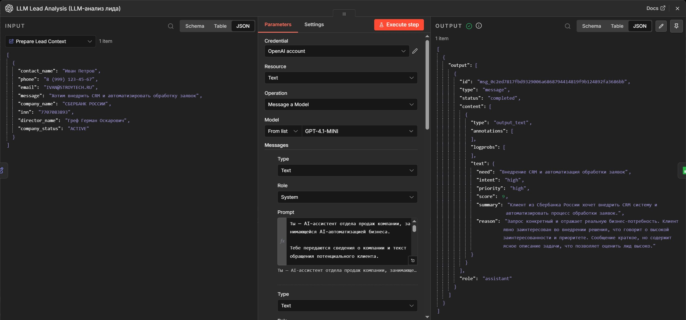
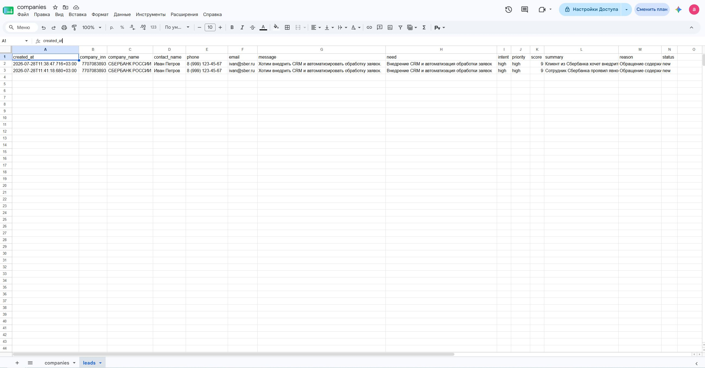
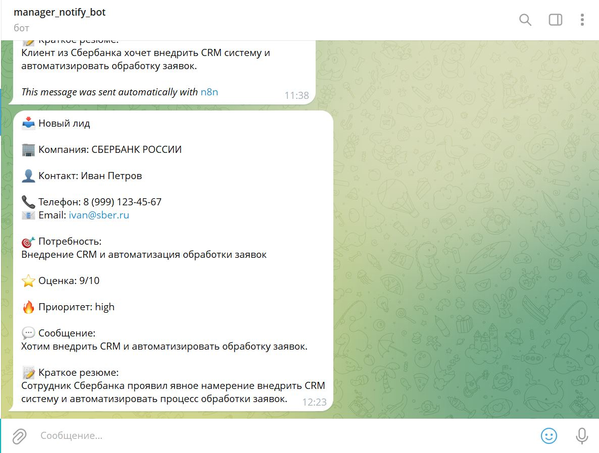

# AI Lead Intelligence System
Automatically enriches incoming B2B leads with company data, qualifies them using AI, stores structured lead information, and instantly notifies the sales team.

---

# Business Problem

Sales teams often receive incomplete or unqualified leads from websites, landing pages, and contact forms.

Before contacting a customer, managers must manually:

- identify the company;
- verify that it exists;
- collect company information;
- evaluate customer intent;
- estimate lead quality;
- save the lead into CRM;
- notify the sales team.

These repetitive tasks slow down response time and reduce sales efficiency.

---

# Target Users

- Sales teams
- B2B companies
- CRM administrators
- Business owners

---

# Solution Overview

This workflow automatically processes every incoming lead.

It enriches company information using DaData, validates business data, checks the internal company repository, creates new company records when necessary, prepares structured context for AI analysis, qualifies the lead using an LLM, stores the analyzed lead in Google Sheets, and immediately notifies the sales team via Telegram.

---

# Workflow Architecture

Complete workflow built in n8n, including validation, company enrichment, AI qualification, CRM storage, and manager notification.

---

## Demo

### API Request

A new lead is sent to the system via an HTTP POST request using Bruno.

---

### AI Lead Qualification

The AI analyzes the incoming lead, identifies the customer's business need, evaluates lead quality, assigns priority, and generates a structured summary.

---

### Lead Repository

The processed lead is automatically stored in Google Sheets as a structured CRM record.

---

### Telegram Notification

The sales manager instantly receives a structured notification containing the lead qualification results.

# Features

- Automatic lead intake via Webhook
- Company enrichment with DaData API
- Contact validation
- Company validation
- Automatic company repository
- AI-powered lead qualification
- Structured AI output (JSON Schema)
- Google Sheets integration
- Telegram notifications
- Fully automated workflow

---

# Tech Stack

- n8n
- OpenAI GPT-4.1 Mini
- DaData API
- Google Sheets
- Telegram Bot API
- Webhooks

---

# Key Skills Demonstrated

- AI Workflow Design
- Business Process Automation
- AI Lead Qualification
- API Integration
- Data Enrichment
- Structured AI Outputs
- JSON Schema
- Google Sheets Automation
- Repository Pattern
- Business Rule Validation
- Workflow Architecture
- Sales Process Automation

---

# Future Improvements

- CRM integration (HubSpot, Bitrix24, Salesforce)
- Duplicate lead detection
- Automatic email follow-up
- AI-generated sales responses
- Lead scoring analytics
- Multi-channel lead intake (Email, Telegram, Website)
- Dashboard for sales managers

## Author

**Alexander Zaytsev**

AI Automation Engineer

- GitHub: https://github.com/AlexZaytsev-ai
- Email: polonix315@gmail.com
